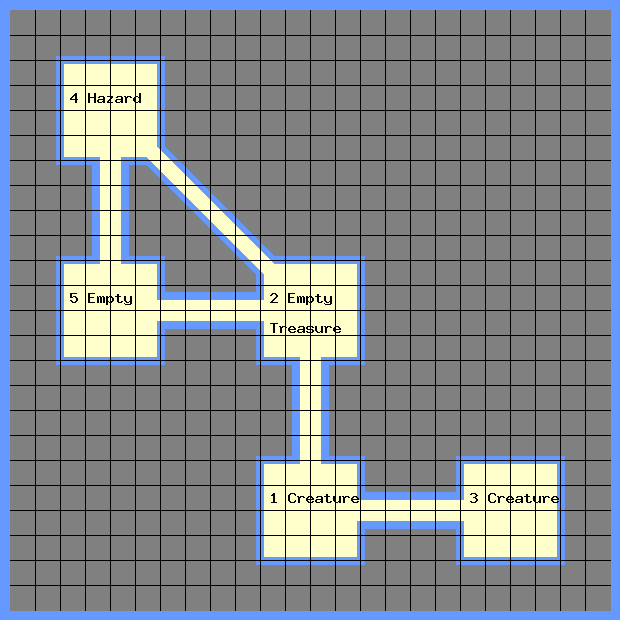

# mapgen - Generate Point Crawls for the Worlds Without Number RPG

WWN includes an algorithm for generating point crawls randomly.  mapgen is a PHP script which automates this algorithm.



You need to install php and gd, on ubuntu the commands are:
```
sudo apt install php7.4-cli
sudo apt-get install php7.4-gd
```
Then you can run the script in one of two ways, at the command line or in a server.

To run the script at the command line, do:
```
php mapgen.php 5 1 1 1 compass square "#6699FF" "#808080" "#FFFFCC" "#6699FF" "#000000" "#000000"
```
It should generate the file map.png.

To run the script in a server, do:
```
php -S localhost:8000
```
and point your browser at http://localhost:8000/.

